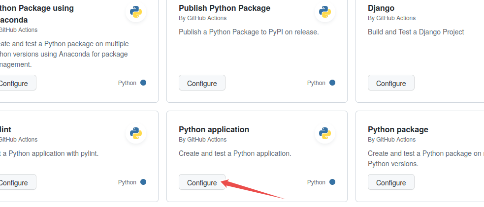
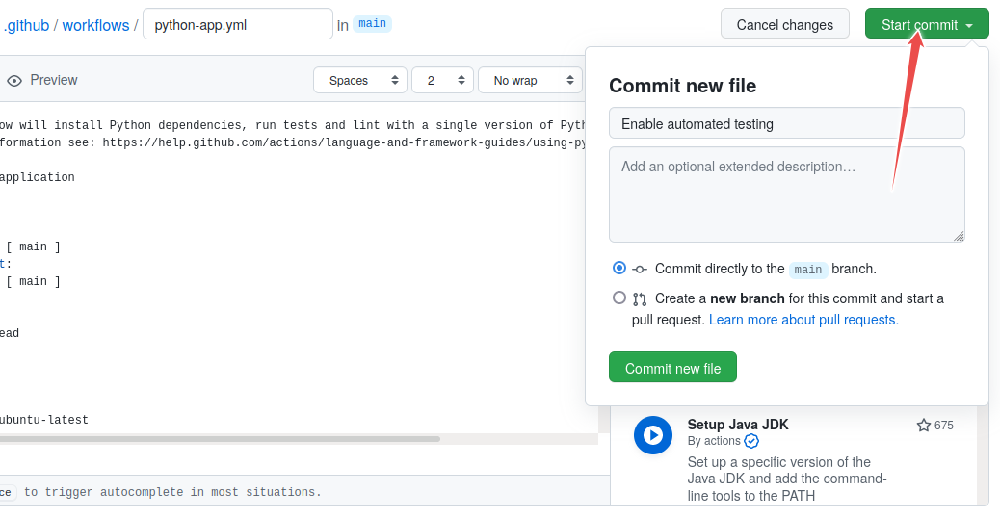
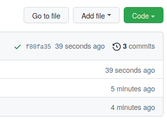

# Exercises

Some exercises to practice our skills through the day:

## 1. Branching workflow

As a Team, work on the following coding taks using a **branching** workflow.

#### Exercise prep

- In your team of 3 - 5 people, assign roles and responsibilities to each member:
   - One project owner
   - One administrator
   - One or more collaborators. Project owners and administrators can also be collaborators.
   - Zero or more reviewers. Collaborators can also be reviewers.
 - [Administrator] Create an exercise repository called branching-workflow-exercise by generating from a template using this template: https://github.com/tu-delft-library/recipe-book-template 
 - [Administrator] Invite all team members to the team's repository as collaborators.
 - Share the link to the newly created repository with your group.

#### Exercise tasks [All Team Members]:

    - Clone the repository to your local machine (if you haven’t already).
    - Choose a recipe you would like to change.
    - Open an issue on github for the change you would like to make.
    - Create a new branch in your local repository for the change you want to make. Name the branch something descriptive of the change you are making.
    - Make a change to the recipe book on the new branch and in the commit cross-reference the issue you opened. 
    - Push the branch to GitHub.


## 2. Pull Requests

Working as a team, merge the changes made in the previous exercise into the main branch of the team’s repository.

#### Exercise tasks

1. [Collaborators] Create a pull request for your own branch. Give your pull request a meaningful name, and a short and clear description that references the issue you raised in the previous exercise.
2. [Team] Are there any conflicts? Resolve them using the GitHuB GUI. Ask for help if you need to.
3. [Collaborators] Merge the pull request to the main branch using the method of their choice.
4. [Collaborators] Check the main branch to confirm that your changes have been merged.

## 3. Forking Workflow

Exercise goal: Practice the forking workflow, which is a common workflow for contributing to open source projects where you don't have write access to the original repository.


#### Exercise prep

1. **The maintainer**: Creates an exercise repository called `forking-workflow-exercise` by generating from a template using this template: https://github.com/tu-delft-library/recipe-book-template 

In this case we do not add collaborators to the repository (this is the point of this exercise).

2. **The maintainer**: Shares the link to the newly created repository with your group.

3. **Learners in exercise team**: Fork the newly created repository (the one created by the maintainer) and then clone your fork. 

4. **The maintainer**: Forks the neighboring team’s repository and clones the fork to their local machine. This is to ensure that the maintainer can also practice the forking workflow and experience the process from the perspective of a contributor.


#### Exercise tasks:

1. Open an issue in the upstream exercise repository where you describe the change you want to make. Take note of the issue number.

2. Clone your fork of the repository to your local machine (if you haven’t already).

3. Create a new branch in your local repository for the change you want to make. Name the branch something descriptive of the change you are making.

4. Make a change to the recipe book on the new branch and in the commit cross-reference the issue you opened.

5. Push the branch to your fork on GitHub.

6. Open a pull request from your branch in your fork to the main branch of the upstream exercise repository. In the pull request description, reference the issue you opened in the upstream repository.

7. Team leaders will merge the pull requests. (Check this: During the review, pay attention to the automated test step (here for demonstration purposes, we test whether the recipe contains an ingredients and an instructions sections).

8. After few pull requests are merged, update your fork with the changes.

9. Check that in your fork you can see changes from other people’s pull requests.


## 4. Code Reviews

Exercise goal: Working in teams. Practice reviewing code in pull requests created in the previous exercise. 
Continue working on the same repository as in the previous exercise.

1. Create a new feature branch and one or few commits: in these improve something but also deliberately introduce a typo and also a larger mistake which we will want to fix during the code review.

2. Push the branch to your fork on GitHub and open a pull request from your feature branch towards the main branch of the upstream repository.

3. As a reviewer to somebody else’s pull request, ask for an improvement and also directly suggest a change for the small typo. (Hint: suggestions are possible through the GitHub web interface, view of a pull request, “Files changed” view, after selecting some lines. Look for the “±” button.)

4. As the submitter, learn how to accept the suggested change. (Hint: GitHub web interface, “Files Changed” view.)

5. As the submitter, improve the pull request without having to close and open a new one: by adding a new commit to the same branch. (Hint: push to the branch again.)

6. Once the changes are addressed, merge the pull request.


## 5. Guidelines for Contributions

1. Working individually, use the `CONTRIBUTING.md` template provided in https://github.com/manuGil/fair-code to add **contributing guidelines** to the very repository used in Lessons 1 and 2. 
2. Adapt the template to your repository as long as time allow it.


## 6. Choosing Licenses and Enabling Software Citation

Working individually. Add a license and citation files to the repository used in Lesson 1 and 2.
1. Use the Open Source Initiative license tool to pick an open source license of your choice: https://opensource.org/licenses
2. Add a `LICENSE` file to your remote repository. Check the [GitHub documentation](https://docs.github.com/en/communities/setting-up-your-project-for-healthy-contributions/adding-a-license-to-a-repository) to know how to add a license file. If you have to, edit the license file to include auhtors name, year, etc.
3. Use this tool to generate a CITATION  file and add it to your remote repository: 
    - Search the Internet for: `cffinit` 


## 7. Full-cycle collaborative workflow

This exercise integrates many of the skills you have learned today and lets you practice using Github Actions to automate software tests.

In this course we use a version from [CodeRefinery](https://coderefinery.github.io/testing/continuous-integration/), with some modifications.

The exercise involves several steps, each with a number of subtasks. Check that each step is correct before proceeding to the next.

In this exercise, everybody will:

- Create a repository on GitHub (everybody should use a unique repository name for their repository) 
- Commit code to the repository and set up tests with GitHub Actions. Intentially, the code contains some bugs and the tests reveal these bugs. 
- Everybody will find a bug in their repository and open an issue in their repository. 
- Then each one will fix the bug in their exercise partner's repository by sending a pull request using the forking workflow. 

### Step 1: Create a new repository 

- Begin by creating a new repository in your GitHub accoount. Make sure you give this repository a unique name, for example, by including your username in the repositopry name, for example, `ci-exercise-yourgitusername`. Otherwise, forking your exercise partner's repository with the same name will lead to confusion.
- Make sure to initialize the repository ** with a README"** (otherwise you try to clone an empty repo).
- Clone the repository to your computer.
- Add the following files and code

Add a file `functions.py` containing:

```python
def add(a, b):
    return a + b

def subtract(a, b):
    return a + b  # <--- fix this in step 7

def multiply(a, b):
    return a * b

def convert_fahrenheit_to_celsius(fahrenheit):
    return multiply(subtract(fahrenheit, 32), 9 / 5) # <-- Fix this in step 7
```
and a file `test_functions.py` containing:

```python
from functions import add, subtract, multiply
from functions import convert_fahrenheit_to_celsius as f2c
import pytest

def test_add():
    assert add(2, 3) == 5
    assert add('space', 'ship') == 'spaceship'

# uncomment the following test in step 5
#def test_subtract():
#    assert subtract(2, 3) == -1

# uncomment the following test in step 11
# def test_convert_fahrenheit_to_celsius():
#    assert f2c(32) == 0
#    assert f2c(122) == pytest.approx(50)
#    with pytest.raises(AssertionError):
#        f2c(-600)

```
Finally, stage the files (`git add <filename>`), commit (`git commit -m "some commit message"`),
and push the changes (`git push origin main`).

### Step 2: Run tests locally

You can now run your tests locally with
```
pytest
```

### Step 3: Enable automated testing


  In this step we will enable GitHub Actions.
  Select "Actions" from your GitHub repository page. You get to a page
  "Get started with GitHub Actions". Select the button for "Configure"
  under Python Application:



*Image source: [CodeRefinery Automated Testing lesson](https://coderefinery.github.io/testing/continuous-integration/), licensed under [CC BY 4.0](https://creativecommons.org/licenses/by/4.0/)*

Select "Python application" as the starter workflow.

GitHub creates the following file for you in the subfolder `.github/workflows`.
Modify the highlighted lines according to the action below. This will add a code coverage
report to new pull requests. The if clause restricts this to pull requests, as otherwise
this action would not have a target to write the reports to. On pushes only the unittesting is run.

```{code-block} yaml
---
emphasize-lines: 14,30,40-46
---
# This workflow will install Python dependencies, run tests and lint with a single version of Python
# For more information see: https://docs.github.com/en/actions/automating-builds-and-tests/building-and-testing-python

name: Test

on:
  push:
    branches: [ "main" ]
  pull_request:
    branches: [ "main" ]

permissions:
  contents: read
  pull-requests: write

jobs:
  build:

    runs-on: ubuntu-latest

    steps:
    - uses: actions/checkout@v4
    - name: Set up Python 3.10
      uses: actions/setup-python@v3
      with:
        python-version: "3.10"
    - name: Install dependencies
      run: |
        python -m pip install --upgrade pip
        pip install flake8 pytest pytest-cov
        if [ -f requirements.txt ]; then pip install -r requirements.txt; fi
    - name: Lint with flake8
      run: |
        # stop the build if there are Python syntax errors or undefined names
        flake8 . --count --select=E9,F63,F7,F82 --show-source --statistics
        # exit-zero treats all errors as warnings. The GitHub editor is 127 chars wide
        flake8 . --count --exit-zero --max-complexity=10 --max-line-length=127 --statistics
    - name: Test with pytest
      run: |
        pytest --cov-report "xml:coverage.xml" --cov=.
    - name: Create Coverage
      if: ${{ github.event_name == 'pull_request' }}
      uses: orgoro/coverage@v3
      with:
          coverageFile: coverage.xml
          token: ${{ secrets.GITHUB_TOKEN }}
```

Commit the change by pressing the "Start Commit" button:



*Image source: [CodeRefinery Automated Testing lesson](https://coderefinery.github.io/testing/continuous-integration/), licensed under [CC BY 4.0](https://creativecommons.org/licenses/by/4.0/)*

Committing the file via the GitHub web interface: follow the flow, give it some commit name. You can commit directly to main.

### Step 4: Verify that tests have been automatically run


Observe in the repository how the test succeeds. While the test is
executing, the repository has a yellow marker. This is replaced with a green
check mark, once the test succeeds:




*Image source: [CodeRefinery Automated Testing lesson](https://coderefinery.github.io/testing/continuous-integration/), licensed under [CC BY 4.0](https://creativecommons.org/licenses/by/4.0/)*

Green check means passed.

Also browse the "Actions" tab and look at the steps there and their output.

### Step 5: Add a test which reveals a problem

After you committed the workflow file, your GitHub/GitLab repository will be ahead of
your local cloned repository.  Update your local cloned repository:

```console
$ git pull origin main
```

Hint: if the above command fails, check whether the branch name on the GitHub
repository is called `main` and not perhaps `master`.

Next uncomment the code in `test_functions.py` under "step 5", commit, and push.
Verify that the test suite now fails on the "Actions" tab.

### Step 6: Open an issue on GitHub

Open a new issue in your repository about the broken test (click the
"Issues" button on GitHub and write a title for the issue).
The plan is that we will fix the issue through a pull request.

### Step 7: Fix the bug revealed by the test

Now fix the code **on a new branch**, you can call it `yourname/bugfix`.
After you have fixed the code on the new branch, commit the following
commit message `"restore function subtract; fixes #1"` (assuming that
you try to fix issue number 1).

```{callout} Shortcut

   Here it's perfectly possible to take a shortcut and commit and push
   directly to the main branch. If you do this, steps 8-9 below are skipped.
   - When would you push directly to the main branch, and when would you send a
   pull request?
```
Then push to your repository.

### Step 8: Open a pull request

Go back to the repository on GitHub and open a pull
request. **In a collaborative setting, you could request a code
review from collaborators at this stage.** Before accepting the
pull request, observe how GitHub Actions
automatically tested the code.

If you forgot to reference the issue number in the commit message, you
can still add it to the pull request: `my pull request
title, closes #1`.

### Step 9: Accept the pull request

Observe how accepting the pull request automatically closes the issue (provided
the commit message or the pull request contained the correct issue number).

See also:
- GitHub: [closing issues using keywords](https://help.github.com/articles/closing-issues-using-keywords/)

Discuss whether this is a useful feature. And if it is, why do you think is it useful?


### Step 10: Increase your code coverage

We are currently missing several functions in our tests. Write a test for the `multiply` function in a new branch and create a pull request.
On Python you can directly observe the increase in code coverage.
If you compare this with the
previous run, you should see an increase once the update is in.

### Step 11 (optional): Repeat steps 5-9 for the `convert_fahrenheit_to_celsius` function:

Repetition helps learning, so let’s do the testing again for our `convert_fahrenheit_to_celsius` function. Uncomment the test for the `convert_fahrenheit_to_celsius` function and repeat steps 5 to 9 fixing the bug this test exposes.

### Discussion

Finally, we discuss together about our experiences with this exercise.

## Where to go from here

- This example was using Python but you can achieve the same automation for R or Fortran or C/C++ or other languages
- This workflow is very useful for collaborators who work on the same code and it works both for
  [centralized](https://coderefinery.github.io/git-collaborative/02-centralized/) and
  [forking](https://coderefinery.github.io/git-collaborative/03-distributed/) workflows - have a look at this
  [alternative exercise](./full-cycle-ci) to see how that works.
- GitHub Actions has a [Marketplace](https://github.com/marketplace?type=actions) which offer wide range of automatic workflows
- On GitLab use [GitLab CI](https://about.gitlab.com/product/continuous-integration/)
- For Windows builds you can also use [Appveyor](https://www.appveyor.com)
